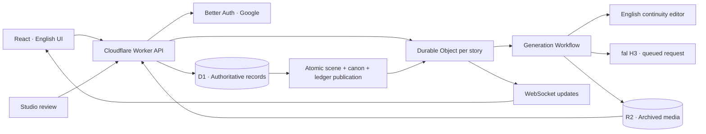

# Architecture



## Story isolation and concurrency

`stories.id` scopes characters, episodes, scenes, queue sequence, active task, favorites, playback state and R2 paths. A per-story Durable Object wakes the queue and broadcasts events. D1 chooses the queue head and enforces admission/publication with atomic triggers. WebSocket upgrades use `stub.fetch`; RPC cannot carry the upgraded response.

Two stories run independently. Shared credit accounts, billing policy, provider wallet and total spending authorization remain global. A proposal cannot silently reference a character or episode from another story.

The preview records the actual story version used. A lease prevents simultaneous preview requests for one idea. Admission compares the accepted timestamp against the stored plan and reserves credit and platform capacity in one transaction. When the queue head is based on older canon, the director replans against the latest published facts. Material changes require author review; that state releases the queue position and reservations.

## Author identity

Authentication IDs are permanent; public names are editable and unique by a normalized key. Google names are not automatically published. Only the user’s own bootstrap/account view and privileged account operations receive email. Public APIs explicitly select public fields.

A scene points to its original author ID and retains its prompt original and English adaptation. Queries join the current public name, so a rename updates old bylines without transferring ownership. Studio fixture openings are labeled as studio work; there are no fabricated community contributors or viewer counts.

## Policy and contribution acceptance

`shared/policies.json` is the current versioned Terms and Privacy text. It is a development draft, not a finalized public policy. Users affirm Terms acceptance and acknowledge the Privacy notice before creating. Refusing leaves watching, existing-task inspection, withdrawal and privacy requests available. Marketing consent is not bundled into this acknowledgment.

The server archives the complete text in `policy_documents`, rejects reuse of a version for changed text, and records one acceptance per user/version with a server timestamp. Users can download their accepted text from Account. Admission records the actual queue sequence, approved plan, plan version, legal version and attribution-confirmation time in the same transaction as credit reservation. Formal policy edits require a new version; do not alter the archived acceptance text.

Production preflight requires finalized operator identity, a matching contact email, effective date and legal release evidence. The full retention/deletion workflow, regional requirements and public age policy remain launch work.

## Canon and character material

The system prompt fixes English output and treats user proposals as untrusted content. Application validation checks character identity scope. The director proposes facts; a reviewer records what the actual video shows. Only successful publication updates character states and canonical events.

Candidates have application-issued IDs tied to their proposal. Approved image and optional 2–5 second voice clips are stored separately from model output. Their name and description must match the current plan. A reference-mode generation stores the exact material snapshot and, when eligible, supplies the previous published clip as a video reference. New characters inherit the material actually used by their first published clip.

The current default is H3 Max Turbo text-to-video. That branch appends fixed character descriptions and current states, records a text snapshot, sends no media inputs and does not require candidate reference images. Reference-file support is now an optional non-default adapter and uses operator-curated HTTPS URLs. Ingesting them into durable owned storage and validating actual image/audio properties are remaining launch requirements. Database identity checks alone cannot ensure a model preserves a face, accent, costume or voice.

## Generation and publication

### Story guides and character history

The publication outbox transaction creates one archive job per story/version and snapshots character states. A separate `ArchiveWorkflow` uses the shared editor to propose a recap, character development, relationships and unanswered threads. Its input contains only that story’s published evidence through the target version. Model-proposed events never become archive evidence by themselves.

Archive content is private until an administrator reviews its English, evidence and unresolved concerns. Source scene IDs, introduction versions and relationship IDs are validated again against currently visible evidence at approval. Approved versions are immutable. Public queries follow playback position and stop before hidden scenes; character notes can reuse earlier approved entries without fabricating missing historical states. A failed model call preserves a conservative editable fallback and does not automatically repeat paid work.

The shared editor records provider model and token usage separately from its conservative cost reservation. Fixture and live editor behavior remain explicit modes.

### Choosing a cast

Optional `characterIds` are normalized into immutable `tasks.requested_character_ids_json`. Admission scope checks and D1 insertion constraints prevent foreign, duplicate or future characters. The full selection is part of the idempotency payload and the private task DTO. The director receives it alongside current canon; reviewed cast substitutions cannot happen silently. [Character image preparation](CHARACTER-IDENTITY.md) separates working reference-material support from the pending image-service workflow.

```text
Draft → reviewed plan → Queued → Preparing → Generating
  → archived, probed footage → NeedsModeration → Published
```

Changed canon or missing materials can return a task to `NeedsReview`. An uncertain external request enters `ReconciliationNeeded`; money stays reserved. The adapter writes an attempt marker before paid network I/O and never blindly resubmits after an uncertain response. Recovery of a known provider request polls the same request through a new recovery Workflow.

R2 transfer is streaming and size bounded. The MP4 probe reads box headers and bounded metadata, not the entire video in Worker memory. The reviewer checks actual English audio/readable text, continuity, content and captions. Publication atomically commits the scene, natural timeline position, approved events, character changes, story version, ledger and outbox.

Current episodes close after a clip crosses the 180-second target. Future editing/packaging must preserve this attribution map while allowing endings at narrative boundaries. Adaptive Stream playback and container-based episode packaging remain planned; they are not running services.

## Costs and limits

Three ledgers serve different purposes: user creation units, platform spending commitments, and provider wallet availability. Failed delivery refunds user units while retaining actual or conservatively estimated platform cost. Old-day in-flight reservations do not disappear at UTC rollover.

Director requests also pass budget guards and record a conservative cost ceiling before the network call. A separately authorized cumulative spend ceiling prevents a small test budget from resetting each day. The current video reservation is a configurable estimate, not a verified provider price guarantee; provider pricing must be verified before enabling live calls.

Provider balance snapshots expire after five minutes. Recorded local debits are retained conservatively across refreshed balance snapshots; this can stop admission early. Per-request billing reconciliation is still required before unattended operation. The product never automatically tops up an external account or charges an end user.

## Payment and generation isolation

`tasks` binds generation mode, provider model and point quote at creation. `payment_orders`, `payment_events`, `paid_credit_accounts`, `paid_credit_ledger` and `billing_requests` are independent of daily `credit_accounts` and the model-provider dollar budget. The same D1 admission/publication transaction reserves and settles the correct balance. Refunds adjust the purchase entitlement; spent refunded points can become debt. The exact Paddle webhook path uses raw-body signatures, while customer and studio billing APIs retain browser-origin and account/role checks. D1 inbox metadata, background processing and cron repair webhook failures without replaying a charge. See [payment contract and setup](PAYMENTS.md).
